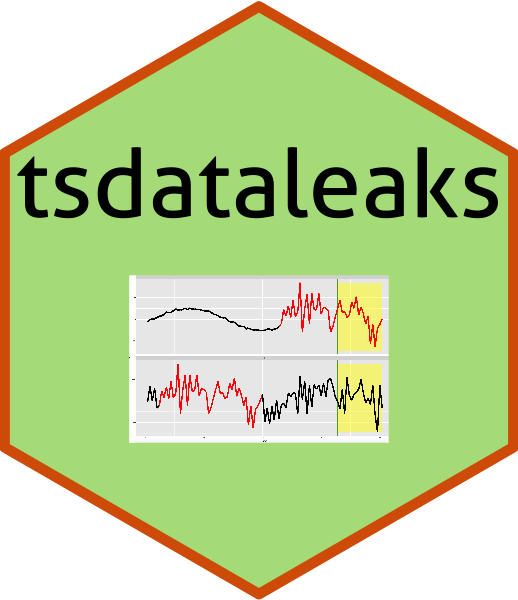

<!-- README.md is generated from README.Rmd. Please edit that file -->



# tsdataleaks


R Package for detecting data leakages in time series forecasting
competitions.

## Installation

<!--You can install the released version of tsdataleaks from -->
<!-- [CRAN](https://CRAN.R-project.org) with: -->
<!--

``` r
install.packages("tsdataleaks")
```

-->

The development version from [GitHub](https://github.com/) with:

``` r
# install.packages("devtools")
devtools::install_github("thiyangt/tsdataleaks")
library(tsdataleaks)
```

## Example

This is a basic example which shows you how to solve a common problem:

To demonstrate the package functionalities, I created a small dataset
with 4 time series.

``` r
set.seed(2020)
a = rnorm(15)
lst <- list(
  a = a,
  b = c(a[10:15]+rep(8,6), rnorm(10), a[1:5], a[1:5]),
  c = c(rnorm(10), a[1:5]),
  d = rnorm(10) )
```

## `find_dataleaks`: Exploit data leaks

``` r
library(tsdataleaks)
library(magrittr)
library(tidyverse)
library(viridis)
# h - I assume test period length is 5 and took that as wind size, h.
f1 <- find_dataleaks(lstx = lst, h=5, cutoff=1) 
f1
$a
  .id start end
2   b     2   6

$b
  .id start end
1   a     1   5
2   b    17  21
4   c    11  15

$c
  .id start end
1   a     1   5
2   b    17  21
3   b    22  26
```

Interpretation: The first element in the list means the last 5
observations of the time series `a` correlates with time series `b`
observarion from 2 to 6.

## `viz_dataleaks`: Visualise the data leaks

``` r
viz_dataleaks(f1)
```

## `reason_dataleaks`

Display the reasons for data leaks and evaluate usefulness of data leaks
towards the winning of the competition

``` r
r1 <- reason_dataleaks(lstx = lst, finddataleaksout = f1, h=5)
r1
```
