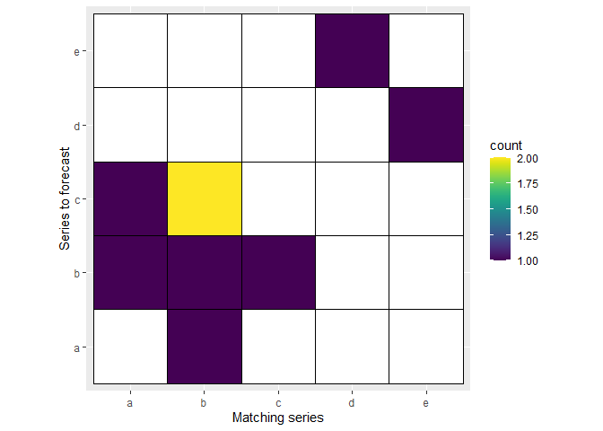
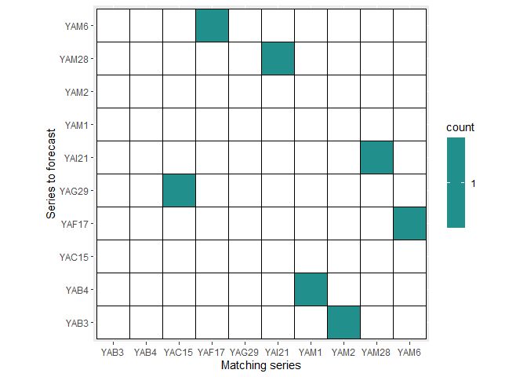
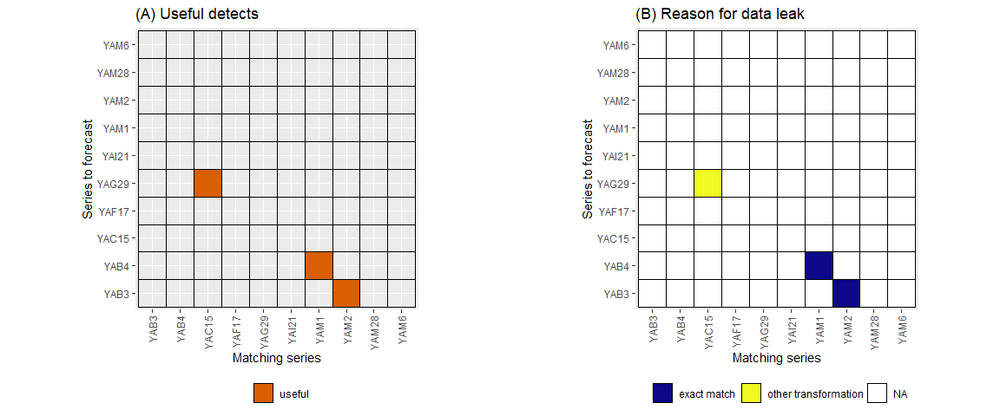

<!-- README.md is generated from README.Rmd. Please edit that file -->


# tsdataleaks

R Package for detecting data leakages in time series forecasting
competitions.

## Installation

<!--You can install the released version of tsdataleaks from -->
<!-- [CRAN](https://CRAN.R-project.org) with: -->
<!--
&#10;``` r
install.packages("tsdataleaks")
```
&#10;-->

The development version from [GitHub](https://github.com/) with:

``` r
install.packages("tsdataleaks")
library(tsdataleaks)
```

or

``` r
# install.packages("devtools")
devtools::install_github("thiyangt/tsdataleaks")
library(tsdataleaks)
```

## Example

To demonstrate the package functions, I created a small data set with 4
time series.

``` r
set.seed(2020)
a <- rnorm(15)
d <- rnorm(10)
lst <- list(
  a = a,
  b = c(a[10:15]+rep(8,6), rnorm(10), a[1:5], a[1:5]),
  c = c(rnorm(10), -a[1:5]),
  d = d,
  e = d)
```

## `find_dataleaks`: Exploit data leaks

``` r
library(tsdataleaks)
library(magrittr)
library(tidyverse)
library(viridis)
# h - I assume test period length is 5 and took that as wind size, h.
f1 <- find_dataleaks(lstx = lst, h=5, cutoff=1) 
f1
$a
  .id start end
2   b     2   6

$b
  .id start end
1   a     1   5
2   b    17  21
4   c    11  15

$c
  .id start end
1   a     1   5
2   b    17  21
3   b    22  26

$d
  .id start end
5   e     6  10

$e
  .id start end
4   d     6  10
```

Interpretation: The first element in the list means the last 5
observations of the time series `a` correlates with time series `b`
observarion from 2 to 6.

## `viz_dataleaks`: Visualise the data leaks

``` r
viz_dataleaks(f1)
[[1]]
```




    [[2]]
    [[2]]$a
      .id start end
    2   b     2   6

    [[2]]$b
      .id start end
    1   a     1   5
    2   b    17  21
    4   c    11  15

    [[2]]$c
      .id start end
    1   a     1   5
    2   b    17  21
    3   b    22  26

    [[2]]$d
      .id start end
    5   e     6  10

    [[2]]$e
      .id start end
    4   d     6  10

## `reason_dataleaks`

Display the reasons for data leaks and evaluate usefulness of data leaks
towards the winning of the competition

``` r
r1 <- reason_dataleaks(lstx = lst, finddataleaksout = f1, h=5)
r1
[[1]]
  series1 .id start end dist_mean dist_sd is.useful.leak dist_cor
1       a   b     2   6      -8.0     0.0         useful        1
2       b   a     1   5       0.0     0.0         useful        1
3       b   b    17  21       0.0     0.0         useful        1
4       b   c    11  15      -1.7     2.6     not useful       -1
5       c   a     1   5       1.7     2.6         useful       -1
6       c   b    17  21       1.7     2.6         useful       -1
7       c   b    22  26       1.7     2.6     not useful       -1
8       d   e     6  10       0.0     0.0     not useful        1
9       e   d     6  10       0.0     0.0     not useful        1
                                     reason
1                              add constant
2                               exact match
3                               exact match
4 multiply by -1 or negative constant value
5 multiply by -1 or negative constant value
6 multiply by -1 or negative constant value
7 multiply by -1 or negative constant value
8                               exact match
9                               exact match

[[2]]
```


# A list without naming element

``` r
a = rnorm(15)
lst <- list(
  a,
  c(a[10:15], rnorm(10), a[1:5], a[1:5]),
  c(rnorm(10), a[1:5])
)
f1 <- find_dataleaks(lst, h=5)
```

``` r
viz_dataleaks(f1)
#> [[1]]
```


    #> 
    #> [[2]]
    #> [[2]]$`1`
    #>   .id start end
    #> 2   2     2   6
    #> 
    #> [[2]]$`2`
    #>   .id start end
    #> 1   1     1   5
    #> 2   2    17  21
    #> 4   3    11  15
    #> 
    #> [[2]]$`3`
    #>   .id start end
    #> 1   1     1   5
    #> 2   2    17  21
    #> 3   2    22  26

``` r
reason_dataleaks(lst, f1, h=5)
#> [[1]]
#>   series1 .id start end dist_mean dist_sd is.useful.leak dist_cor      reason
#> 1       1   2     2   6         0       0         useful        1 exact match
#> 2       2   1     1   5         0       0         useful        1 exact match
#> 3       2   2    17  21         0       0         useful        1 exact match
#> 4       2   3    11  15         0       0     not useful        1 exact match
#> 5       3   1     1   5         0       0         useful        1 exact match
#> 6       3   2    17  21         0       0         useful        1 exact match
#> 7       3   2    22  26         0       0     not useful        1 exact match
#> 
#> [[2]]
```


# Application to M-Competition data

## M1 Competition - Yearly data

``` r
library(Mcomp)
data("M1")
M1Y <- subset(M1, "yearly")
M1Y_x <- lapply(M1Y, function(temp){temp$x})
m1y_f1 <- find_dataleaks(M1Y_x, h=6, cutoff = 1)
m1y_f1
#> $YAF17
#>     .id start end
#> 22 YAM6     9  14
#> 
#> $YAM6
#>      .id start end
#> 16 YAF17    16  21
#> 
#> $YAM28
#>      .id start end
#> 78 YAI21    16  21
#> 
#> $YAB3
#>     .id start end
#> 18 YAM2    14  19
#> 
#> $YAB4
#>     .id start end
#> 17 YAM1    15  20
#> 
#> $YAI21
#>      .id start end
#> 43 YAM28    16  21
#> 
#> $YAG29
#>       .id start end
#> 137 YAC15     6  11
```

``` r
viz_dataleaks(m1y_f1)
#> [[1]]
```



    #> 
    #> [[2]]
    #> [[2]]$YAF17
    #>     .id start end
    #> 22 YAM6     9  14
    #> 
    #> [[2]]$YAM6
    #>      .id start end
    #> 16 YAF17    16  21
    #> 
    #> [[2]]$YAM28
    #>      .id start end
    #> 78 YAI21    16  21
    #> 
    #> [[2]]$YAB3
    #>     .id start end
    #> 18 YAM2    14  19
    #> 
    #> [[2]]$YAB4
    #>     .id start end
    #> 17 YAM1    15  20
    #> 
    #> [[2]]$YAI21
    #>      .id start end
    #> 43 YAM28    16  21
    #> 
    #> [[2]]$YAG29
    #>       .id start end
    #> 137 YAC15     6  11

``` r
reason_dataleaks(M1Y_x, m1y_f1, h=6, ang=90)
#> [[1]]
#>   series1   .id start end dist_mean dist_sd is.useful.leak dist_cor
#> 1   YAF17  YAM6     9  14       5.4     0.4     not useful        1
#> 2    YAM6 YAF17    16  21      -5.4     0.4     not useful        1
#> 3   YAM28 YAI21    16  21       0.0     0.0     not useful        1
#> 4    YAB3  YAM2    14  19       0.0     0.0         useful        1
#> 5    YAB4  YAM1    15  20       0.0     0.0         useful        1
#> 6   YAI21 YAM28    16  21       0.0     0.0     not useful        1
#> 7   YAG29 YAC15     6  11  -36815.7  6159.2         useful        1
#>                 reason
#> 1 other transformation
#> 2 other transformation
#> 3          exact match
#> 4          exact match
#> 5          exact match
#> 6          exact match
#> 7 other transformation
#> 
#> [[2]]
```


