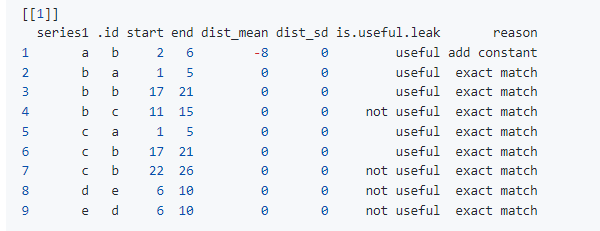

# Summary

Forecasting competitions are of increasing importance as a mean to learn best practices and gain knowledge. Data leakage is one of the most common issues that can often be found in competitions. Data leaks can happen when the training data contains information about the test data. There are a variety of different ways that data leaks can occur with time series data. For example: i) randomly chosen blocks of time series are concatenated to form a new time series, ii) scale-shifts, iii) repeating patterns in time series,  iv) white noise is added in the original time series to form a new time series, etc.  This work introduces a novel tool to detect these data leaks. The tsdataleaks package provides simple and computationally efficient algorithm to exploit data leaks in time series data. This paper demonstrates the package design and its power to detect data leakages using recent forecasting competitions data.


# Statement of Need


Time series forecasting competitions have played a significant role in the advancement of forecasting practices. Typically, in forecasting competitions, a collection of time series is given to the competitors, and then the competitors submit the forecasts for the required test period of each time series. During the competition period only the training set of each time series is given to the public, and the test set is kept private from the public. Finally, competition organizers evaluate the forecast accuracy comparing the test set of each series and submitted forecasts by the competitors. Forecasting competitions helps to identifying novel methods and facilitating their performance comparison against existing state-of-the-art forecasting techniques [@hyndman2020brief]. Further, from empirical evidence how to improve forecasting performance and advance the theory and practice of forecasting


Data leakage occur when the training period of the time series includes test period data before officially release the test period of the time series.  This idea is illustrated in \autoref{fig:fig1}. A and B are two time series. The latter segment of the training set and the subsequent test set within the (B) series is derived from a training segment inherent to series (A). This type of data leak could occur when a randomly chosen blocks of time series are concatenated to form a new time series. 

{height=30%}

Competitions with data leaks will not be able to reach the original purpose. By exploiting data leakage competitors can obtain a top rank in the leader board. Such models look highly accurate within the competition environment but becomes inaccurate when applying the to a data set outside the competition environment. There is an increasing need to examine the potential data leaks in time series before the release of data to public. The tsdataleaks package is designed to identify data leaks in time series.


# State of the Field in R


As of the latest information available on the Comprehensive R Archive Network (CRAN) Task View: Time Series Analysis [@ctv], there is no package available for detecting data leakages.

# Algorithm

The algorithm operates as follows: it selects the final segment of the training portion from each time series in the collection, moves through all of the time series by one lag, and calculates the Pearson's correlation coefficient. Hence, the input to the algorithm are: i) the time series collection, ii) segment length, and iii) cut of value for the correlation coefficient serve as the algorithm's inputs. The algorithm returns the starting and end index of  the segments that match each time series' training part of the last segment.

| **Algorithm: Time Series Matching**                                 |
|---------------------------------------------------------------------|
| **Input:**                                                          |
| 1. *lst*: A collection of time series as a list.     |
| 2. *h*: Length of the segment to be considered.        |
| 3. *cutoff*: Cut-off value for the absolute value of the Pearson's correlation coefficient. |
|                                                                     |
| **Output:**                                                         |
|  A list containing starting and ending indices of segments that match each time series' training part of the last segment. |
|                                                                     |
| **Steps:**                                                          |
| 1. *Initialize* an empty list: *matching_segments*.                 |
| 2. *Loop through each time series* in the *lst*: |
|    a. Extract the final segment of the training portion with length *h*. |
|    b. *Loop through the time series* with a step of one time point, considering each segment: |
|       - Calculate the Pearson's correlation coefficient between the extracted segment and the current segment. |
|       - If the correlation coefficient is above the *cutoff*: |
|          - Return the matching segments list with the starting and ending indices of the matching segments. |
| 3. *Return* the matching segments list as the output.             |

\newpage

 \autoref{fig:fig21} illustrates the first iteration of the algorithm.
 
 \autoref{fig:fig22} visualize the second iteration of the algorithm. At the second iteration correlation between the observation 2-7 and the purple segment is measured. \autoref{fig:fig22} illustrates an intermediate step of the algorithm.


{height=30%}

{height=30%}

{height=30%}

# Usage

## Installation

The package tsdataleaks is available on [GitHub](https://github.com/thiyangt/tsdataleaks) and can be installed and loaded into the R session using:

```r
devtools::install_github("thiyangt/tsdataleaks")
library(tsdataleaks)
```

## Functionality

There are three functions in the package: i) `find_dataleaks`, ii) `viz_dataleaks` and iii) `reason_dataleaks`. To demonstrate the package functions, I created a small data set with 4 time series. 

```r
set.seed(2024)
a <- rnorm(15)
d <- rnorm(10)
lst <- list(
  a = a,
  b = c(rnorm(10), a[1:5], a[1:5]),
  c = c(rnorm(10), a[10:15]),
  d = d)
```

Following are the steps in detecting data leakages and visualize the results.

Step 1: The main function in the package is `find_dataleaks`. It exploits the data leakages according to the algorithm.  The inputs to the function are list of time series collection (lst), length of the segment to be considered (h), and cutoff value for absolute value of the Pearson's correlation coefficient (cutoff).

```r
f1 <- find_dataleaks(lstx = lst, h=5, cutoff=1) 
```

Step 2: `viz_dataleaks` function visualize the results obtained in `find_dataleaks` for easy understanding as shown in \autoref{fig:fig4}

```r
viz_dataleaks(f1)
```


Step 3: `reason_dataleaks` displays the reasons for data leaks and evaluate usefulness of data leaks towards the winning of the competition. The inputs to the function are list of time series collection (lst), length of the segment to be considered (h), output of the find_dataleaks function (finddataleaksout).

```r
reason_dataleaks(lstx = lst, finddataleaksout = f1, h=5)
```


For example, according to the 2nd row in the output, series b last part correlates with series a index 2 to 6. Hence, series `a` segment indices 7-12  can be the  series b remaining part. Hence, this identification is an useful identification. Furthermore, according to the fourth row of the same output series b last part correlates with series c segment with indices 11-15. However, we do not have observations from 16 on wards for the series c. Hence, it is not a useful identification in winning the forecasting competition. 

{height=50%}

# Appication to the M1 competition yearly time series data

When, applying to `find_dataleaks` to the yearly time series in the Mcop package first, the training parts of all the series re stored into a list. In the M1 competition, length of the test period for yearly series is 6. Hence, `h` value is selected as 6. The cutoff value for the Pearson's correlation coefficient is 
```r
library(Mcomp)
data("M1")
M1Y <- subset(M1, "yearly")
M1Y_x <- lapply(M1Y, function(temp){temp$x})
m1y_f1 <- find_dataleaks(M1Y_x, h=6, cutoff = 1)
m1y_f1
```

The outputs of the above code and application  of other functionalities are available at package readme file at https://github.com/thiyangt/tsdataleaks

# Conclusion

The new open source R package described in this paper enable, i) exploit data leakages, ii) identify the reasons for data leakage as exact match or add a constant, iii) determining whether the data leakages identified are useful in winning the forecast competition and iv) visualize the results. tsdataleaks is a valuable tool for competition Organizers to avoid data leakages , Competitors to detect data leakages, and participants alike, entire forecasting research community to evaluate quality of data.

# Reproducibility

Codes to generate this manuscript is available at https://github.com/thiyangt/tsdataleaks

# References

